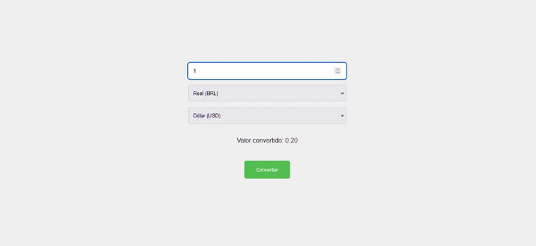

# Conversor de Moedas

 
 
 - Conversor de Moedas (EURO/DOLAR/REAL)

 - Projeto construído durante o curso PROPROFISSÃO.

 - Valores em tempo real.

## Acesso 👨🏻‍💻
 [Clique aqui para acessar! :)](https://conversor-fellype.vercel.app/)

## Tecnologias 👾
- HTML
- CSS
- ReactJS
- API
- Git e Github

## Contato
[(LinkedIn)](https://www.linkedin.com/in/fellype-oliveira-920699230/)
-----
fellypeoliveira2020@gmail.com
